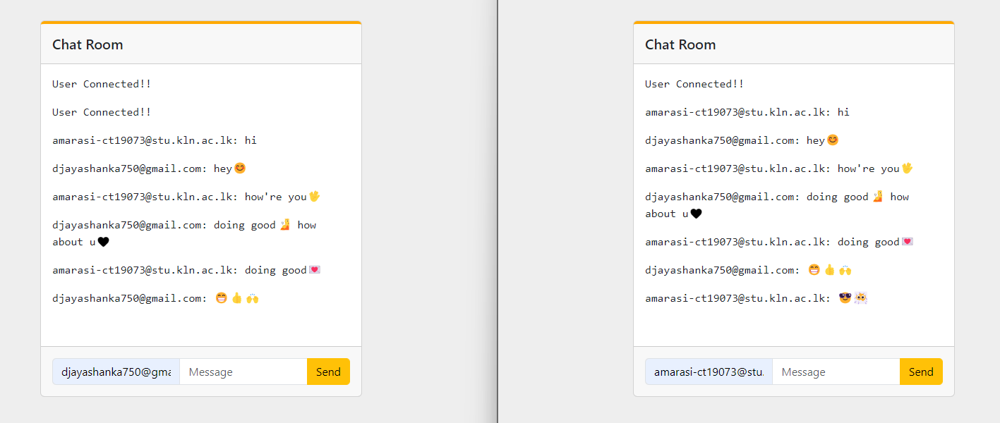

# 💬 Chat Application

A real-time Chat Application developed using **Python**, **Flask**, **Flask-SocketIO**, **SQLite**, **HTML**, **CSS**, and **JavaScript**. The application allows users to register, log in securely, and communicate instantly through a real-time chat interface.

---

# 📌 Project Overview

This project is a web-based real-time chat application that enables users to create accounts, log in securely, and exchange messages in real time.

The application uses **Flask-SocketIO** for instant messaging, **SQLite** for user data storage, and **Flask-Login** for authentication.

---

# 🚀 Features

- User Registration
- User Login & Logout
- Real-time Messaging
- User Authentication
- Flask-SocketIO Integration
- SQLite Database
- Responsive User Interface
- Secure Session Management

---

# 🛠️ Technologies Used

- Python
- Flask
- Flask-SocketIO
- Flask-Login
- Flask-SQLAlchemy
- SQLite
- HTML5
- CSS3
- JavaScript
- Bootstrap

---

# ⚙️ Installation

### Clone the Repository

```bash
git clone https://github.com/nunnapushpa1-cpu/Chat-Application.git
```

### Navigate to the Project Folder

```bash
cd Chat-Application
```

### Install Dependencies

```bash
pip install -r requirements.txt
```

### Run the Application

```bash
python app.py
```

### Open in Browser

```
http://127.0.0.1:5001
```

---

# 🌐 Application Routes

| Route | Description |
|--------|-------------|
| `/` | Home Page |
| `/signup` | Register a New User |
| `/login` | Login Existing User |
| `/chat` | Real-time Chat Room |

---

# 📷 Application Screenshot



---

# 📚 Concepts Learned

- Flask Routing
- Flask Templates (Jinja2)
- Flask-Login Authentication
- Flask-SocketIO
- Real-time Communication
- SQLite Database
- Session Management
- Git & GitHub Workflow

---

# 🔮 Future Improvements

- Group Chat
- Private Messaging
- Online/Offline Status
- Typing Indicator
- Emoji Support
- File Sharing
- Dark Mode
- Mobile Responsive UI

---

# 📝 Notes

- User information is stored in a local SQLite database (`users.db`).
- Database tables are automatically created on the first run.
- Press **Ctrl + C** in the terminal to stop the application.

---

# 👨‍💻 Author

**Nunna Pushpa**

Aspiring Full Stack Developer

---

⭐ If you found this project helpful, feel free to explore the repository.